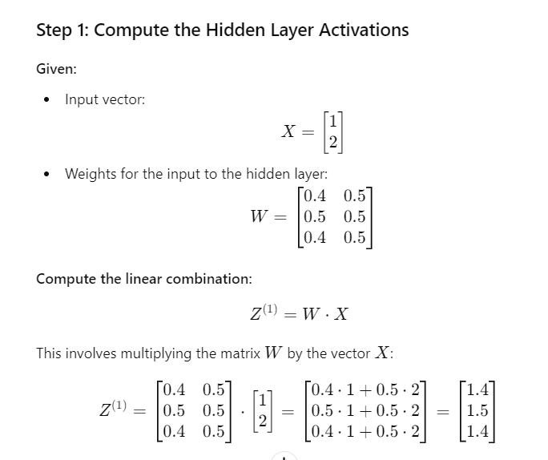
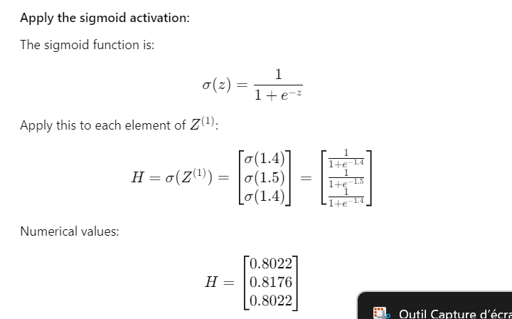
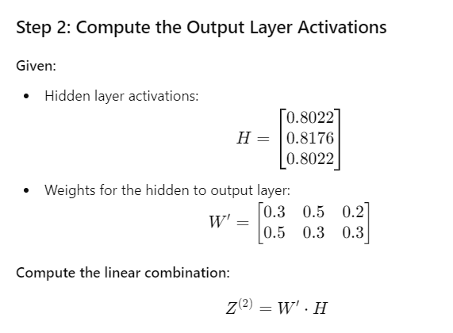
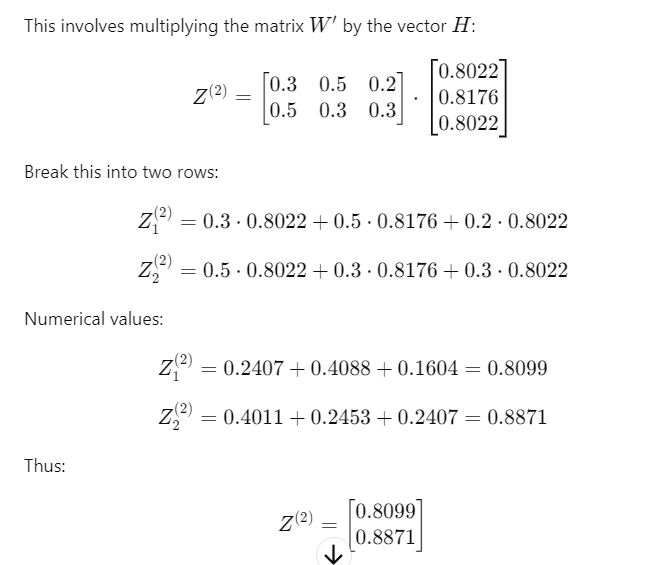
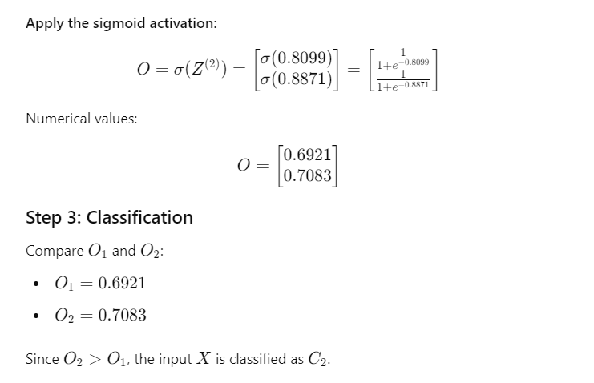

# Vision par ordinateur

c'est nous qui travaillions

## image numérique

definition - nombre de pixel constituant l'image (nombre total)

résolution - nombre de point par unité de longueur (la densité de pixel) en DPI

HD - haute definition

un pouce - 2.54

## la pofondeur des couleurs

le bpp

toute les combinaison possible sont de 2 puissance le nombre de bits

soit le plus courant 256 avec 8 bits

bien sur plus on a une image à une grande profondeur de couleur plus elle sera lourde

la definition * le bpp(en octet) - le poids (octet)

(1080*1920) * 256 - taille de mon image

## pavage

attention les cercles sur des images sont composée de petit carrées

chaque pixel ne peut pas faire 2 couleur en meme temps

## codage

les image sont codée sous forme de tableau, soit

I(6,1) - 64

Au pixel 6 a la ligne 1, on a un gris suivant le 64

### Couleur

additive, avec le RGB ou RVB en anglais

attention il y a aussi le systeme soustractive

Lookup Table (LUT) est un tableau qui represente toute les combinaisons de couleur de l'image

Dans la memoire on va enregistre le codage et non la matrice brute

# Deep leanring et vision par ordinateur

on parle de deep learning supervisé

donnée - observation et etiquettes

connaissance - relation entrée sortie

## Comment fixe des couches

on calcule le nombre de poids

Dans l'exemple on a 50 variables de poids

Attention, il me faut donc 50 images par classe

## Exercice foward propagation

### Enoncé

input vector X = [1;2]
Output classes O1 & O2
Neural Network trained 2*3*2 where : 
W = [0.4 0.5; 0.5 0.5; 0.4 0.5]
W' = [0.3 0.5 0.2; 0.5 0.3 0.3]
F is a sigmoid activation function
Question : X is a C1 ou C2 ?

### Solution

